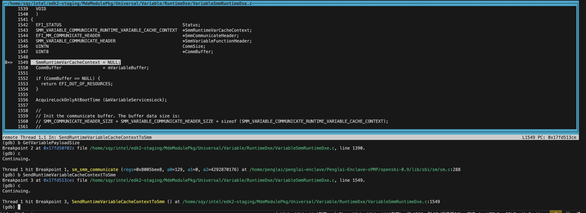

# 使用GDB调试penglai monitor和UEFI edk2的教程

# Qemu
## Step 1：以调试模式启动qemu
具体来说，是让qemu加载image之后停在入口，监听一个端口，之后使用gdb attach上去调试。
操作方法：
- 在启动qemu时加上-s - S 参数， 其中-s参数相当于 -gdb tcp::1234,意思是qemu监听tcp的1234端口， -S是指让qemu停在镜像的入口点
- 参考如下qemu执行脚本：

```sh
nc -z  127.0.0.1 54320 || /usr/bin/gnome-terminal -x ./soc_term.py 54320 &
nc -z  127.0.0.1 54321 || /usr/bin/gnome-terminal -x ./soc_term.py 54321 &
while ! nc -z 127.0.0.1 54320 || ! nc -z 127.0.0.1 54321; do sleep 1; done
./qemu-system-riscv64 -nographic \
  -M virt,pflash0=pflash0,pflash1=pflash1,acpi=off \
  -m 4096 -smp 2 \
  -dtb ./qemu-virt-new.dtb \
  -bios ./Penglai-Enclave-sPMP/opensbi-0.9/build-oe/qemu-virt-mm/platform/generic/firmware/fw_dynamic.elf \
  -blockdev node-name=pflash0,driver=file,read-only=on,filename=edk2-staging/RISCV_VIRT_CODE.fd \
  -blockdev node-name=pflash1,driver=file,filename=edk2-staging/RISCV_VIRT_VARS.fd \
  -serial tcp:localhost:54320 -serial tcp:localhost:54321 \
  -device qemu-xhci -device usb-mouse -device usb-kbd \
  -drive file=fat:rw:~/intel/src/fat,id=hd0 -device virtio-blk-device,drive=hd0 \
  -s -S
```


## Step 2：使用gdb调试
### Method 1: 使用docker 中的 riscv64-unknown-elf-gdb 来调试：
- 需要用到riscv64-unknown-elf-gdb来调试，riscv相关的toolchain在penglai的docker里面都准备好了，在docker里面的路径是 /home/penglai/toolchain

具体操作步骤是：
- 直接起penglai的docker，需要带--network=host参数
```
docker run -v $(pwd):/home/penglai/penglai-enclave -w /home/penglai/penglai-enclave --network=host --rm -it ddnirvana/penglai-enclave:v0.5 bash
```
- 进入docker之后执行（gdbscript来自下文步骤3）：
```
../toolchain/bin/riscv64-unknown-elf-gdb -ix gdbscript
```

### Method 2: 使用编译的binutil 中的 gdb 来调试（本仓库的方法）：
具体步骤：
- Compile the latest gdb for riscv
```
git clone https://sourceware.org/git/binutils-gdb.git
cd binutils-gdb
./configure --enable-targets=all
make -j16
```
- 执行gdb
```
./binutils-gdb/gdb/gdb -x gdbscript
```

## Step 3：创建gdb脚本
1. Copy all the content from normal world log generate above and save it to debug.log
2. Then create the gen_symbol_offsets.sh script（这里假设Penglai-Enclave-sPMP和EDK2源码在上级目录）

```sh
#!/bin/bash
LOG="./debug.log"
BUILD="../edk2-staging/Build/RiscVVirtQemu/DEBUG_GCC5/RISCV64/"
PEINFO="peinfo/peinfo"

cat ${LOG} | grep Loading | grep -i DxeCore | while read LINE; do
    BASE="`echo ${LINE} | cut -d " " -f4`"
    NAME=DxeCore.efi
    ADDR="`${PEINFO} ${BUILD}/${NAME} | grep -A 5 text | grep VirtualAddress | cut -d " " -f2`"
    TEXT="`python3 -c "print(hex(${BASE} + ${ADDR}))"`"
    SYMS="`echo ${NAME} | sed -e "s/\.efi/\.debug/g"`"
    echo "add-symbol-file ${BUILD}/${SYMS} ${TEXT}"
done

cat ${LOG} | grep Loading | grep -i efi | while read LINE; do
    BASE="`echo ${LINE} | cut -d " " -f4`"
    NAME="`echo ${LINE} | cut -d " " -f6 | tr -d "[:cntrl:]"`"
    ADDR="`${PEINFO} ${BUILD}/${NAME} | grep -A 5 text | grep VirtualAddress | cut -d " " -f2`"
    TEXT="`python3 -c "print(hex(${BASE} + ${ADDR}))"`"
    SYMS="`echo ${NAME} | sed -e "s/\.efi/\.debug/g"`"
    echo "add-symbol-file ${BUILD}/${SYMS} ${TEXT}"
done
```

3. Create the gdbscript with below content

产生UEFI symbol：
```sh
git clone https://github.com/retrage/peinfo.git
cd peinfo
make
```
```
./gen_symbol_offsets.sh > 1.txt
```
创建gdbscript文件：（这里假设Penglai-Enclave-sPMP和EDK2源码在上级目录）
- 把archtechure设置为riscv64，并且连上1234端口的qemu，设置源码目录，然后加载penglai monitor的镜像符号，开启源码GUI
```
set architecture riscv:rv64
target remote localhost:1234
set directories ../Penglai-Enclave-sPMP/opensbi-0.9
set directories ../edk2-staging/

add-symbol-file ../Penglai-Enclave-sPMP/opensbi-0.9/build-oe/qemu-virt-mm/platform/generic/firmware/fw_dynamic.elf 0x80000000

tui enable
```
将1.txt中的UEFI add symbol指令补充到gdbscript中：
```
cat 1.txt >> gdbscript
```

## Step 4：开始调试
进入gdb之后就跟正常使用gdb一样了，有一点不同的是调试的进程已经是运行的状态，断点设置好之后是continue命令，而不是run命令。



# Visionfive2
## Step 1：Enabled Debugger on VisionFiveV2 （OpenOCD +  GDB）


# Questions:
- UEFI module的Entrypoint 不是 .text段起始地址？
- 为什么加载UEFI symbol文件时（即add-symbol-file uefi .debug文件时）用的地址是 .text段起始地址？而加载penglai elf时用的地址是加载地址？
- peinfo是用来做什么的，获取了elf文件的哪些信息？
